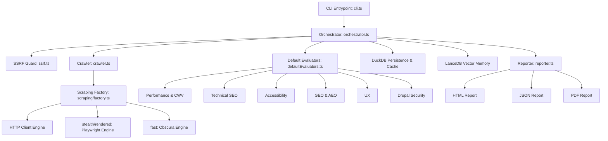

# 📐 Architecture Documentation — `stealth-lightbeacon-node`

This document details the system architecture, internal data flows, security boundaries, and database layouts of the `stealth-lightbeacon-node` platform.

---

## 1. System Overview

`stealth-lightbeacon-node` is a decoupled, modular site auditing CLI. It operates via a single orchestration controller that coordinates crawl dispatching, security guarding, HTML parsing, multi-domain evaluation, and relational/vector analytic persistence.



---

## 2. Component Design & Responsibilities

### 2.1 The Orchestrator (`src/core/orchestrator.ts`)
The orchestrator is the structural bridge connecting all components. It coordinates the following sequential phases:
1. **SSRF Guard Initialization**: Resolves safety policies and validates target URL hosts.
2. **Crawl Phase**: Dispatches the BFS crawler with concurrency throttles and limits.
3. **Auxiliary Probing**: Queries external APIs (e.g., Google PageSpeed Insights, robots.txt, or specific JSON:API user pathways).
4. **Evaluation Loop**: Feeds each crawled page and external context into the list of registered evaluators.
5. **Analytics Injection**: Flushes run logs, site performance metrics, and caching summaries into DuckDB, and embeds semantic nodes into LanceDB.
6. **Reporting**: Triggers HTML/JSON/PDF builders.

### 2.2 Async Bounded Crawler (`src/core/crawler.ts`)
The crawler implements a queue-driven, breadth-first search (BFS) walk:
- **Worker Pool**: Limits simultaneous requests to control resource overhead and avoid trigger rate-limit blocks on target servers.
- **SSRF Verification**: Every redirect location discovered during the crawl is verified dynamically against the security policy before dispatch.
- **Fail-Safe Loop**: Isolates failed or non-200 responses to the `brokenPages` dataset to prevent runtime crashes.

### 2.3 SSRF Guard (`src/core/ssrf.ts`)
A zero-trust security interceptor designed to prevent Server-Side Request Forgery and Host Header hijacking.
- **Host Resolution**: Resolves IP addresses before firing actual network calls.
- **IP Range Filtering**: Blocks private (RFC 1918), loopback (`127.0.0.1`, `::1`), and link-local (`169.254.169.254`) address ranges unless `--allow-private` is explicitly activated.
- **SSRFGuardAgent Socket Pinning**: Hooks into Node's HTTP/HTTPS `Agent` layer via `createConnection` to pin connections to resolved, pre-validated IP sockets. This prevents DNS-rebinding time-of-check time-of-use (TOCTOU) exploits without altering TLS Host negotiations or SNI server expectations.

### 2.4 Scraping Engines (`src/core/scraping/`)
- **`http`**: Node's native `fetch` agent, utilizing `SSRFGuardAgent` to secure HTTP/HTTPS requests against routing escapes.
- **`stealth` / `rendered`**: Playwright Chromium integrations. Enforces **Chromium DNS Pinning** by configuring secure loopback forwarding proxies and browser routing rules, neutralizing Playwright-level DNS-rebinding attacks.
- **`fast`**: Spawns a native compiled Rust subprocess (`obscura`) designed for high-frequency static HTML scrapes, with strict redirect boundaries and limit flags handled by Node's secure child-process wrapper.
- **CLI Process Teardown**: Hooks `BrowserPool.getInstance().close()` into evaluation `finally` blocks, cleanly killing Chromium instances on normal/abnormal exit to prevent headless process leaks.

### 2.5 Dynamic Evaluator Registry (`src/core/evaluatorRegistry.ts`)
Decoupled dynamic plugin registry transitioning the engine from static array lookups to contract-backed registries. It registers evaluators by a unique ID, exposes type-safe lifecycle hooks, and enforces execution-order rules, enabling smooth third-party plugin extension.

### 2.6 Concurrency & Transaction Safety (`src/core/cache.ts`, `src/core/crawler.ts`)
- **Mutex-Protected POP**: Secures DuckDB crawl queue POP routines via in-memory mutexes, preventing concurrent workers from running duplicate crawlers on identical URLs.
- **Transactional Cache Retries**: PageSpeed DuckDB cache writing utilizes transactional abort rollbacks and exponential backoffs (up to 5 attempts) to resolve DuckDB lock contention during parallel write surges.

---

## 3. Database Layer

`stealth-lightbeacon-node` utilizes a dual-engine embedded database stack to achieve ultra-fast queries and semantic analysis without requiring an external database cluster.

```
┌────────────────────────────────────────────────────────┐
│               Embedded Storage Engine                  │
├──────────────────────────┬─────────────────────────────┤
│         DuckDB           │          LanceDB            │
│  (Relational Caching &   │   (Semantic Vectors &       │
│    Structured Queries)   │     Memory Storage)         │
└──────────────────────────┴─────────────────────────────┘
```

### 3.1 DuckDB Relational Caching
- **Implementation**: `@duckdb/node-api`.
- **Purpose**: Stores historical run metrics, PageSpeed Insights API caches, and page-level metadata.
- **Schema Safety**: Managed by strict `zod` schema definitions (`src/core/db/schemas.ts`), shielding queries against SQL injection and ensuring structural envelope stability.

### 3.2 LanceDB Vector Indexing
- **Implementation**: `@lancedb/lancedb` (loaded lazily on demand).
- **Purpose**: Manages dense vectors representing site contents and heading scopes. Useful for semantic similarity searches, GEO content relevance audits, and AI-driven retrieval patterns.

---

## 4. Multi-Domain Evaluators (`src/evaluators/`)

Evaluators follow a standardized functional interface, executing parallel analyses of crawled documents:

- **`PerformanceEvaluator`**: TTFB speed boundaries, legacy image detection (checking non-WebP/AVIF images), and checking Drupal performance aggregations.
- **`SeoEvaluator`**: Header structures, canonical schemes validation, robots.txt blocks alignment, meta descriptions and titles.
- **`AccessibilityEvaluator`**: ALT tags analysis, controls labeling, headings order walk (detecting skipped header levels), and empty button text.
- **`GeoEvaluator` / `AeoEvaluator`**: Factoring authority checks, trustworthy outbound citations (mapping to academic `.edu`/`.gov` structures), author profile completeness, and keyword density.
- **`UxEvaluator`**: Typography dimensions checks, viewports configuration, tap target paddings, and menu structures.
- **`DrupalSecurityEvaluator`**: Exposed generator tags, public paths vulnerability, insecure session cookie configs, and security headers.

---

## 5. CI/CD Integration

`stealth-lightbeacon-node` is designed to be embedded directly into deployment pipelines. It provides pre-built integration recipes (`.github/workflows/`, `.gitlab-ci.yml`, `bitbucket-pipelines.yml`) to enforce budget thresholds (Performance, SEO, AEO, UX, Accessibility) before production rollouts, enabling continuous security and quality auditing.
